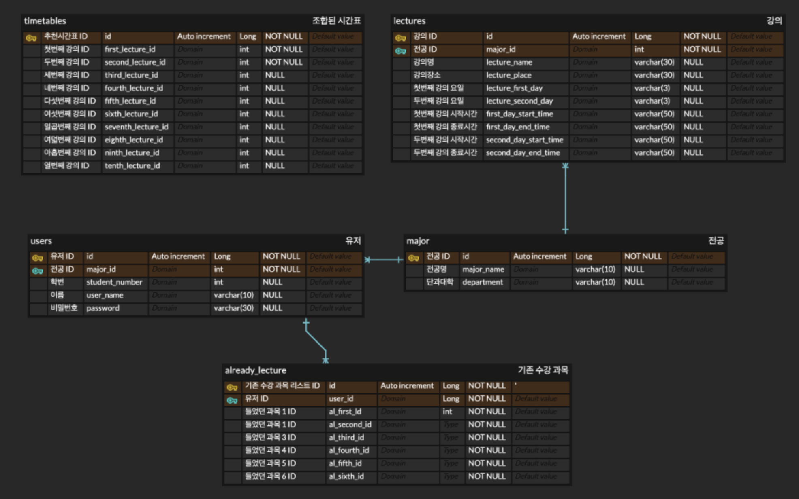

# 2023-2-OSSProj-TurtleNeck-9

2023-2 오픈소스소프트웨어프로젝트 
9조 거북목의 레포지토리입니다.

## 📌 프로젝트 주제

동국대학교 공과대학 시간표 추천 서비스

## Team Detail

<!--

| 이름   | 전공           | E-mail |
| ------ | -------------- | ------------------- |
| 정지만 | 산업시스템공학과 | wlaks2317@gmail.com |
| 김성준 | 산업시스템공학과 | jobcho6320@naver.com |
| 황재영 | 수학과        | jaey0913@dongguk.edu | -->

||                  |  |
|:---:|:-------------------------------------------------------------------------------------------:|:------------------------------------------------------------------------:|
|[정지만](https://github.com/jjm2317)|                            [김성준](https://github.com/SeongJoon-K)                            |                  [황재영](https://github.com/hwangjy0913)                   |
|산업시스템공학과|                                          산업시스템공학과                                           |                                   수학과                                    |
|Frontend|                                           Backend                                           |                             Machine Learning                             |
| |   AWS ec2, s3 기반 자동배포 및 빌드 구축   시간표 조회 구현, 로그인, 회원가입,  Spring security JWT 인증인가   |         훈련 데이터 전처리,   모델 훈련 및 훈련 가중치 저장   ML 서버, 훈련 모델 생성   예측 알고리즘 BeamSearch 구현            |

## ⌨️ 커밋 컨벤션 

다음 컨벤션을 따릅니다.

| 커밋 타입 | 설명                               |
|-----------|----------------------------------|
| `feat`    | 새로운 기능을 추가할 경우                   |
| `fix`     | 버그를 고친 경우                        |
| `style`   | 코드 포맷 변경, 세미 콜론 누락, 코드 수정이 없는 경우 |
| `refactor`| 리팩토링 하는 경우                       |
| `chore`   | 자잘한 수정 사항 반영                     |
| `docs`    | 문서를 수정한 경우                       |
| `test`    | 테스트 추가                           |
## 🛠️ Tech Stack

### ✔️Back-end
  
  
  

  

  

### ✔️Frond-end

  
  
  
  

  

### ✔️ ML
  
  
  
  
  

## 💻 개발 환경

### OS

- Ubuntu 22.04 LTS

### Backend
- Java 17 (Corretto 17)
- Spring Boot v3.1.4
- MySQL 8.0.33
- Intellij
- Gradle v8.3

### Frontend
- HTML5, CSS, JavaScript
- React 
- BootStrap v5.2
- Visual Studio Code v1.78.2

### Storage
- AWS RDS t3.micro
- AWS S3

### ML
- Python 3.10.12
- Tensorflow 2.15.0
- Pandas 2.1.3
- Visual Studio Code 1.84.2
- Google Colab

## 📌 프로젝트 내용 (Description)

동국대학교 공과대학 시간표 추천시스템을 통해서 학생들의 기존 수강 과목을 기반하여, 전공 과목간의 연속성을 확보
전공별로 진로 분야가 다른 공과대학 학생들의 학업 성취도 고취 및 취업 시장에서의 경쟁력을 확보할 수 있도록 함.

## 🛒 ERD

###  사용한 오픈소스 라이브러리 

### 환경 설정 및 실행 CLI

## License

해당 프로젝트는 MIT License를 따릅니다.
